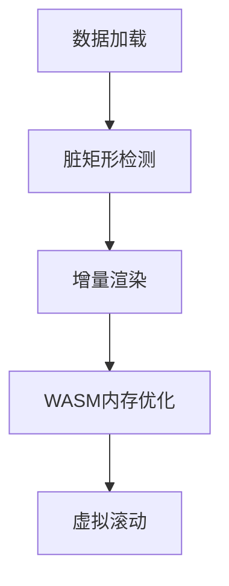

# Hyper Gantt 开发计划

## 1. 项目概述
基于WebAssembly和Bevy ECS的高性能甘特图组件，将采用MVP(最小可行产品)策略优先验证核心算法。

## 1.1 MVP阶段 (1周)
#### 核心目标
- 验证时间轴算法可行性
- 测试基础渲染性能
- 确认核心架构设计

#### 关键任务
- [ ] 时间轴核心算法实现
- [ ] 基础ECS框架搭建
- [ ] 测试数据生成工具
- [ ] 控制台验证关键路径算法

基于WebAssembly和Bevy ECS的高性能甘特图组件，提供完全可定制化的任务管理可视化方案。

## 2. 开发阶段规划

### 2.1 基础框架阶段 (1周)
#### 核心目标
- 搭建ECS基础架构
- 建立WASM通信层
- 实现基本渲染管线

#### 关键任务
- [ ] 核心组件实现 (Task/Timeline/Dependency)
- [ ] wasm-bindgen基础绑定
- [ ] 双渲染模式框架搭建
- [ ] 基础事件系统

### 2.2 核心功能阶段 (3周)
#### 核心目标
- 实现甘特图核心功能
- 建立完整交互系统
- 确保基础性能指标

#### 关键任务
- [ ] 时间轴计算与渲染系统
- [ ] 任务布局与依赖关系算法
- [ ] 拖拽/缩放交互实现
- [ ] 虚拟滚动优化

### 2.3 高级功能阶段 (2周)
#### 核心目标
- 增强交互体验
- 实现专业级功能
- 完善错误处理

#### 关键任务
- [ ] 操作历史与撤销系统
- [ ] 关键路径计算算法
- [ ] 上下文菜单系统
- [ ] 键盘快捷键支持

### 2.4 样式系统阶段 (1周)
#### 核心目标
- 实现高度可定制化
- 建立主题系统
- 完善视觉元素

#### 关键任务
- [ ] 主题配置框架
- [ ] 条件样式规则引擎
- [ ] 多源图标系统集成

## 3. 技术实施方案

### 3.1 性能关键路径

### 3.2 核心算法
1. **时间轴刻度计算**
   - 工作日历感知
   - 多粒度支持(天/周/月)
   - 节假日特殊处理

2. **依赖关系布局**
   - 贝塞尔曲线路径计算
   - 自动避障算法
   - 箭头样式配置

3. **关键路径分析**
   - 拓扑排序实现
   - 动态规划计算
   - 浮动时间可视化

## 4. 风险控制矩阵

| 风险项 | 概率 | 影响 | 缓解措施 |
|--------|------|------|----------|
| WASM包体积超标 | 中 | 高 | 代码分割+Tree Shaking |
| 万级任务渲染卡顿 | 高 | 高 | 分级渲染+Web Worker |
| 复杂依赖计算超时 | 中 | 中 | 算法优化+缓存机制 |
| 跨浏览器兼容问题 | 低 | 中 | 特性检测+Polyfill |

## 5. 质量保障计划

### 5.1 测试策略
- **单元测试**: 核心算法100%覆盖
- **集成测试**: 跨模块功能验证
- **性能测试**: 基准对比(10k/100k任务)
- **兼容测试**: 主流浏览器矩阵

### 5.2 文档体系
1. API文档 (Rustdoc生成)
2. 架构设计文档
3. 示例工程集
4. 故障排查指南

## 6. 交付里程碑

- M0: MVP验证完成 (2025-07-15)
- M1: 基础框架验证 (2025-07-22)
- M2: 核心功能完成 (2025-08-12)
- M3: 高级功能实现 (2025-08-26)
- M4: 样式系统完工 (2025-09-02)
- RC: 发布候选版 (2025-09-09)

## 7. 附录

### 7.1 技术栈清单
- Rust 1.75+
- wasm-bindgen 0.2.89+
- Bevy 0.13+
- web-sys 0.3.66+

### 7.2 参考资源
1. [Bevy ECS最佳实践]
2. [WASM性能优化指南]
3. [甘特图算法研究论文]
